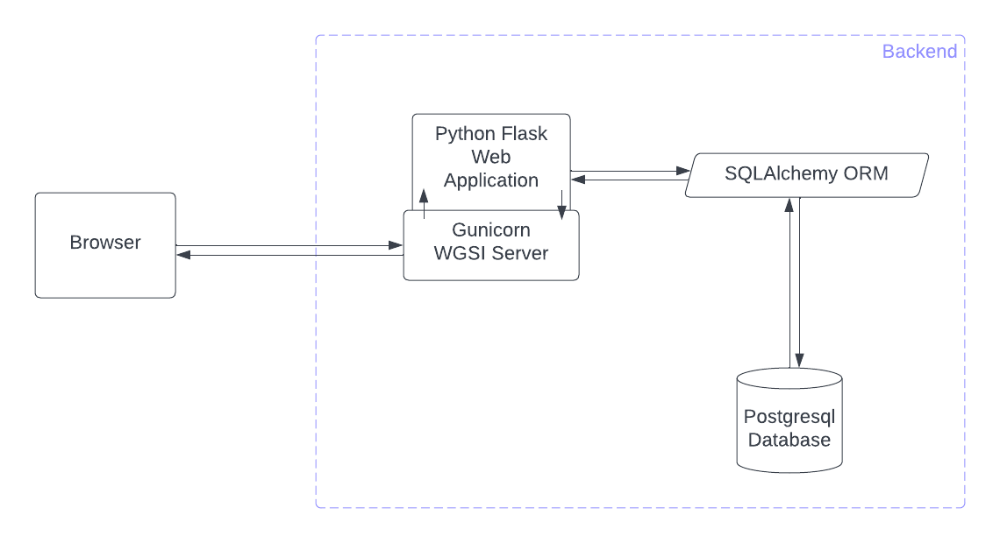

# have a nice wee day

a web application that allows users to generate a dynamic single-page 'uplifting' scroller to share with others.  

## features

* simple user interface and experience
* different options to customise the look and feel of the scroller
* optional account creation to save and edit scrollers (a fake email address can be used)
* receivers can view by direct URL
* cute

## philosophy

for those who want to show others they care or are simply thinking of them. intended to sit somewhere in between an e-card and a surprise bouquet of flowers in thoughtfulness, a considered uplifting sentiment or pick me up, designed well, and communicated digitally.

## technology

### architecture



### security

the flask talisman extension is used to handle setting HTTP headers that can help protect against some common web application security issues. jinja2 templating language is used to render HTML templates, which automatically escapes HTML to prevent XSS attacks. inline javascript has also been moved to separate files to help prevent XSS attacks. SQLAlchemy ORM is used to reduce the risk of SQL injection.

### setting up a development environment

to run this web application locally, clone or download the repository and create a new virtual environment in the root folder. activate the virtual environment and install the required packages. either execute `run.py` or use `gunicorn` to run the web app locally. 
while in the project directory, from your command line:

```
# Create a new virtual environment
$ python3 -m venv venv

# Activate the virtual environment
$ source venv/bin/activate

# Install dependencies
$ python -m pip install -r requirements.txt

# Run the web app
$ python run.py

# Alternatively
$ gunicorn run:app
```

navigate to the local host address in your preferred browser. this will be displayed in the command line (eg, http://127.0.0.1:5000/ or http://127.0.0.1:8000/).

## roadmap

have a nice wee day is currently in early stage development. a working MVP was deployed in April 2022. the M*L*P is due sometime in the summer of 2022.